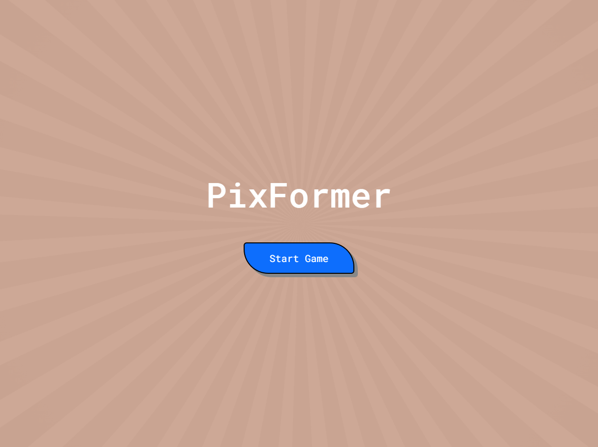
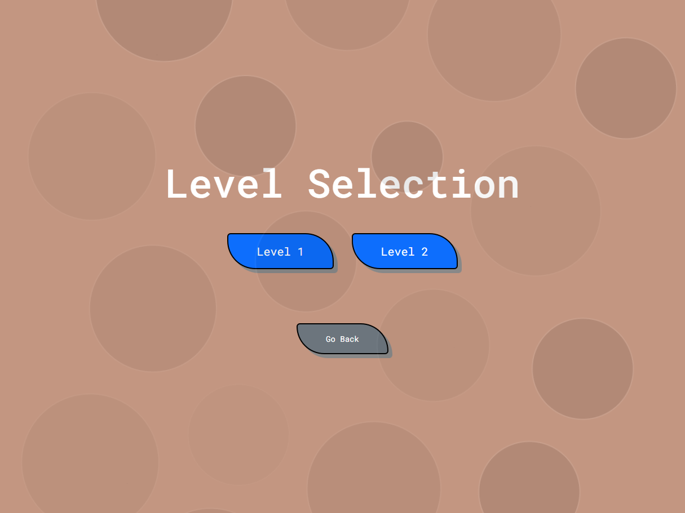
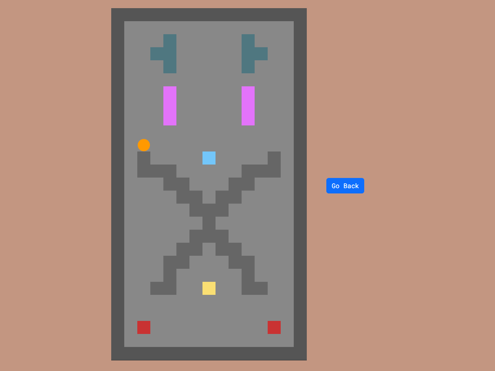

# PixFormer

Pixel Platformer - A simple platform game written in JavaScript

## Features
- Multi-level
- Per-level actions
- Set speed, gravity, friction, bounce ...etc

https://github.com/user-attachments/assets/dd9149f8-c4c7-40d6-8b11-6ccf8c807083

